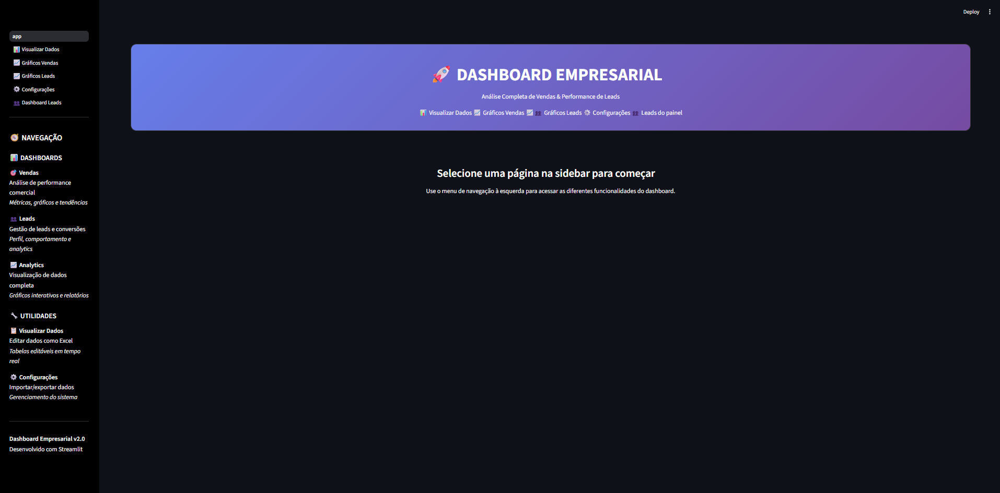
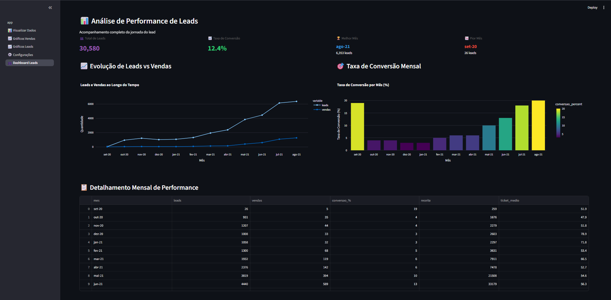
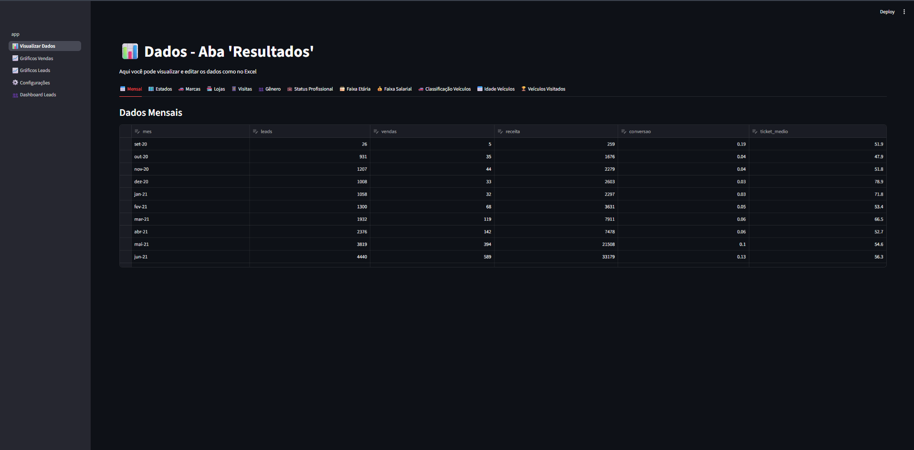
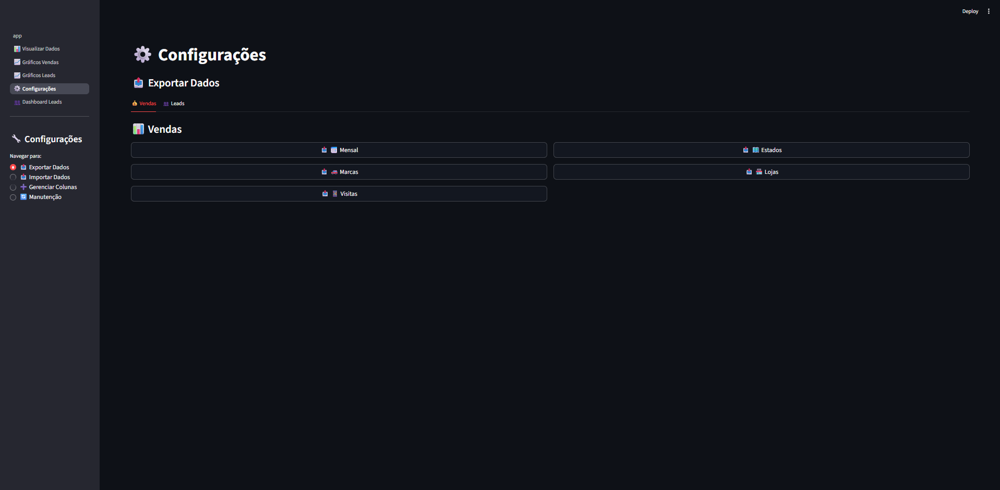

# 📊 Dashboard de Análise de Vendas & Leads

<div align="center">


**Dashboard interativo desenvolvido como projeto final do curso de SQL para Análise de Dados: Do básico ao avançado**
**Criado por Midori Toyota pela plataforma Udemy**

[](https://seusuario-streamlit-app.streamlit.app/)
[](https://github.com/seuusuario/dashboard-vendas-leads)

</div>

## 🎯 Sobre o Projeto

Como parte da conclusão do meu curso de **PostgreSQL**, desenvolvi este dashboard completo para demonstrar minhas habilidades em **análise de dados** e **visualização**. A aplicação consolida conceitos avançados de SQL com Python para criar uma ferramenta empresarial prática e profissional.

> 💡 **Destaque Técnico:** Todo o modelo de dados foi estruturado seguindo as melhores práticas de normalização SQL que aprendi no curso.

## 📸 Screenshots



| **👥 Performance de Leads**| **💰 Dashboard de Vendas**  |
|---------------|--------------|
|  |  | 

| **📊 Visualizar Dados**| **⚙️ Configurações**  |
|---------------|--------------|
|  |  | 

## 🚀 Funcionalidades

### 💰 **Dashboard de Vendas**
- 📈 **Performance Mensal**: Tendências de receita e vendas
- 🗺️ **Análise Geográfica**: Mapa de vendas por estado
- 🚗 **Performance por Marca**: Market share e categorias
- 🏪 **Ranking de Lojas**: Performance por unidade
- 📊 **KPIs em Tempo Real**: Métricas essenciais de negócio

### 👥 **Dashboard de Leads**
- 👤 **Segmentação Demográfica**: Idade, gênero, localização
- 💼 **Perfil Profissional**: Status profissional e faixa salarial
- 🚗 **Preferências**: Tipo de veículo e idade preferida
- 🏆 **Veículos Mais Visitados**: Top modelos e marcas
- 📈 **Funil de Conversão**: Journey completo do lead

### ⚙️ **Recursos Técnicos**
- 📤 **Exportação de Dados**: CSV e relatórios personalizados
- 📥 **Importação Flexível**: Múltiplos formatos de arquivo
- 🔧 **Gerenciamento de Colunas**: Estrutura dinâmica de dados
- 🎨 **Interface Responsiva**: Design moderno e intuitivo

## 🛠️ Tecnologias & Habilidades

### **Backend & Análise**
[](https://skillicons.dev)

### Habilidades demonstradas no projeto
- Python 3.11+
- Pandas (Manipulação avançada de dados)
- PostgreSQL (Modelagem e consultas complexas)
- NumPy (Cálculos numéricos)
  
Frontend & Visualização
python
- Streamlit (Framework web)
- Plotly (Gráficos interativos)
- CSS Personalizado (Design profissional)
- Visualização Geográfica (Mapas e heatmaps)
  
DevOps & Deploy
python
- Git & GitHub (Controle de versão)
- Streamlit Cloud (Deploy automatizado)
- Gestão de Dependências
- CI/CD Básico
  
## 📊 Estrutura do Projeto
text
dashboard-vendas-leads/

├── 📁 pages/                 # Módulos da aplicação

│   ├── 1_📊_Dados.py        # Gerenciamento de dados

│   ├── 2_💰_Dashboard_Vendas.py

│   ├── 3_👥_Dashboard_Leads.py

│   └── 4_⚙️_Configurações.py

├── 📁 utils/                 # Lógica de negócio

│   ├── 📁 core/             # Funcionalidades centrais

│   ├── 📁 vendas/           # Específico para vendas

│   ├── 📁 leads/            # Específico para leads

│   └── 📁 config/           # Configurações do sistema

├── 📁 styles/               # Estilos CSS

├── 📄 requirements.txt      # Dependências

└── 📄 README.md            # Documentação

## 🚀 Como Executar
Pré-requisitos
```bash
Python 3.8+
Git
```
Instalação e Execução
```bash
# 1. Clone o repositório
git clone (https://github.com/DioCrM22/vendas-leads-analytics.git)

# 2. Acesse o diretório
cd vendas-leads-analytics

# 3. Instale as dependências
pip install -r requirements.txt

# 4. Execute a aplicação
streamlit run app.py

# 5. Acesse no navegador
# http://localhost:8501
```
Deploy Automático
O projeto está configurado para deploy automático no Streamlit Cloud. Qualquer push para a branch main atualiza automaticamente a aplicação.

## 📈 Próximos Passos
Integração com banco de dados PostgreSQL em tempo real

Autenticação de usuários

Relatórios automatizados por email

Análises preditivas com machine learning

Dashboard mobile responsivo

# 👨‍💻 Sobre o Desenvolvedor
Diogo Maia -  Desenvolvedor Junior

📍 São Paulo, SP  
📧 **diogocrmaia03@gmail.com**  
💼 **[LinkedIn - Diogo Cruz Maia]** **(https://www.linkedin.com/in/diogo-maia-30585b230)**  

---

## 📄 Licença
Este projeto está sob a licença MIT. Veja o arquivo LICENSE para detalhes.


<div align="center">
⭐ Se este projeto te ajudou, deixe uma estrela no repositório!

Desenvolvido com 💙 e ☕ durante o curso de PostgreSQL

</div> 
